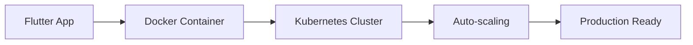

<h1 align="center">
    
</h1>

<h3 align="center">🚀 Full-Stack Developer | Morocco 🇲🇦 ➜ Hungary 🇭🇺 | Building Production-Ready Apps</h3>

 

 
 🔭 I'm currently working on **Football Management System** with **500+ users**
 
 🌱 I'm currently mastering **Docker, Kubernetes, CI/CD, AWS**

 💼 Looking for **DevOps Engineer** or **Flutter Developer** opportunities

 💬 Ask me about **Flutter, Firebase, Payment Systems, DevOps** or anything [here](https://github.com/salahbensarar1)

 ⚡ Fun fact **Game of Thrones Night's Watch cloaks are made from Ikea rugs**

 🌍 **Languages**: Arabic (Native), French (Professional), English (Professional), Hungarian (Intermediate)

 

## 🎯 Current Focus

| 🏗️ **Building** | 📚 **Learning** | 🎯 **Goal** |
|:---:|:---:|:---:|
| Football Management SaaS | Docker & Kubernetes | DevOps Engineer Role |
| Payment Tracking System | CI/CD Pipelines | Cloud Architecture |
| Multi-tenant Architecture | Infrastructure as Code | Production Deployment |

 

 
  
  
  

## 🛠️ Tech Stack & Tools

### 💻 **Development**

### 🗄️ **Backend & Database**

### ☁️ **DevOps & Cloud**

### 🎨 **Frontend & Design**

 

## 🚀 Featured Projects

<table>
<tr>
<td width="50%">

### 🏈 Football Management System
**Production App • 500+ Users**

- 💰 **Payment Tracking** with automated reminders
- 👥 **Multi-role Authentication** (Admin, Coach, Receptionist)
- 🌍 **Multi-language Support** (4 languages)
- 📱 **Cross-platform** (iOS, Android, Web)
- ⚡ **Real-time Updates** with Firebase

**Tech**: Flutter, Firebase, Cloudinary, Stripe

</td>
<td width="50%">

### ☕ IoT Coffee Controller
**Hardware Integration**

- 🔌 **Real-time Communication** with Socket.IO
- 📱 **Mobile Control Interface**
- ⏰ **Scheduling & Automation**
- 📊 **Usage Analytics**

**Tech**: Flutter, Socket.IO, IoT, Real-time

</td>
</tr>
</table>

  <h2>🐍 My Contributions 🐍</h2>
   
  
    

## 📊 GitHub Analytics

<h2 align="center">⚡ GitHub Statistics ⚡</h2>

  
  

 

  
  

## 🎯 What I'm Building Next

**🔄 DevOps Pipeline**: Transforming my Flutter football app into a fully automated, scalable, production system

**📈 Learning Path**: Docker ➜ Kubernetes ➜ CI/CD ➜ Cloud Architecture ➜ DevOps Engineer

### 💡 Open to Opportunities

**🎯 Seeking**: DevOps Engineer | Flutter Developer | Full-Stack Developer positions

**📍 Location**: Hungary (EU Student Permit) | Remote | Willing to relocate

**🚀 Next Goal**: Combine my Flutter expertise with DevOps skills to build and deploy scalable applications

---

<i>"Building the bridge between great code and great infrastructure"</i>

⭐ **From building apps to scaling them in production** ⭐

